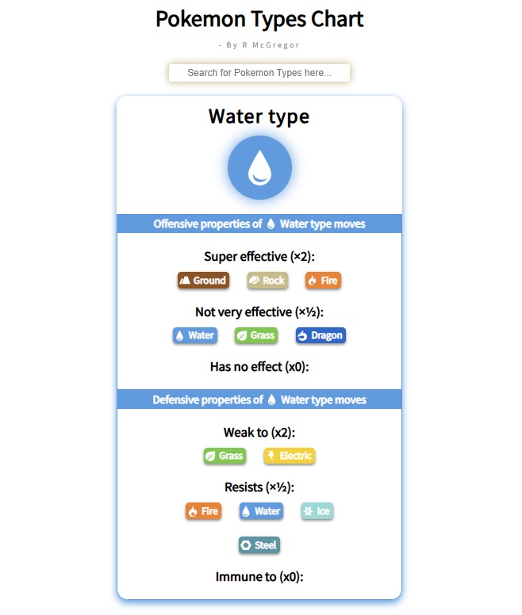

# Pokemon-Types-Ref-App-REACT

A Pokemon types chart app that the user can reference when looking up Pokemon type effectiveness.

I wanted to go back and work with REACT again because I haven't done it in some time and with my new skills in Typescript I wanted to combine the two and make a fun little app.

Currently the app will start with all types and the user can either scroll through or they can use the search bar at the top to refine what they are looking for.
I am thinking of maybe having the first screen just be the circle logos for each type and then the user can select the icon to show the type effectiveness chart that way.
I will come back and refine this later on whilst i work on scarpening my other skills.

To see a working version of this app, please use my CodeSandbox link below:

https://6ckjc7-3000.csb.app/
